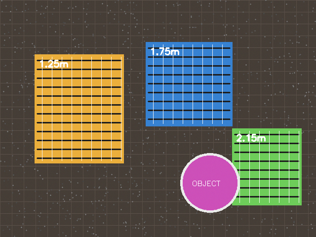
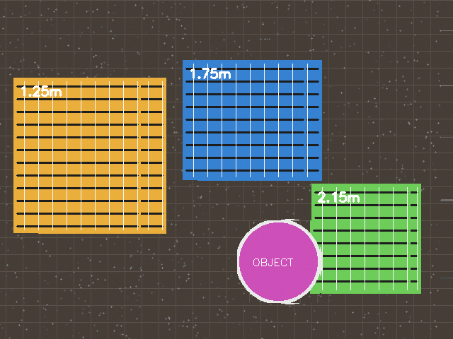
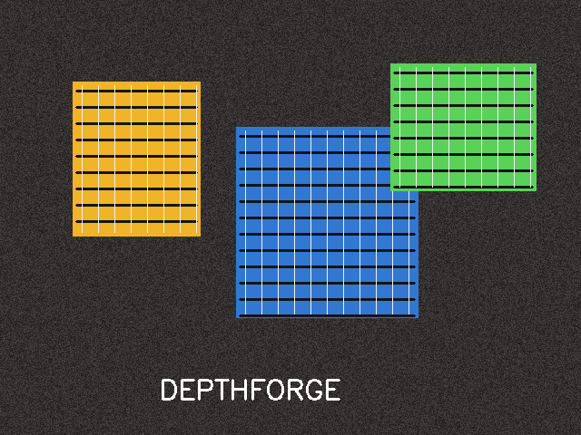
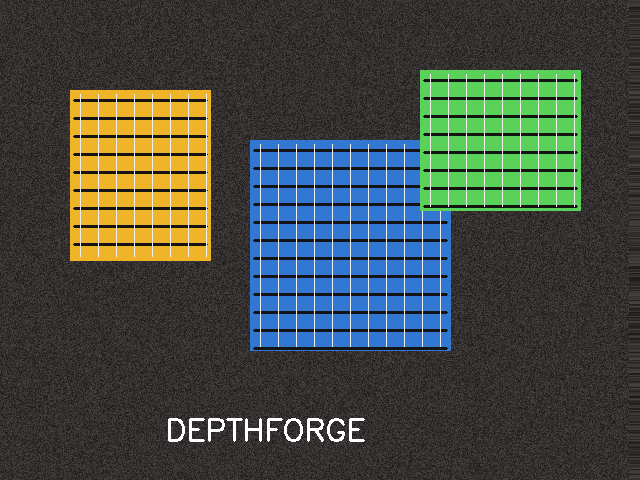
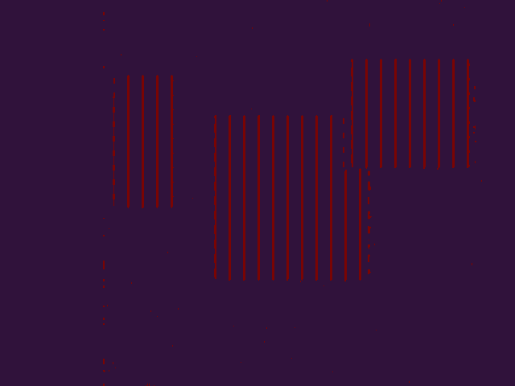
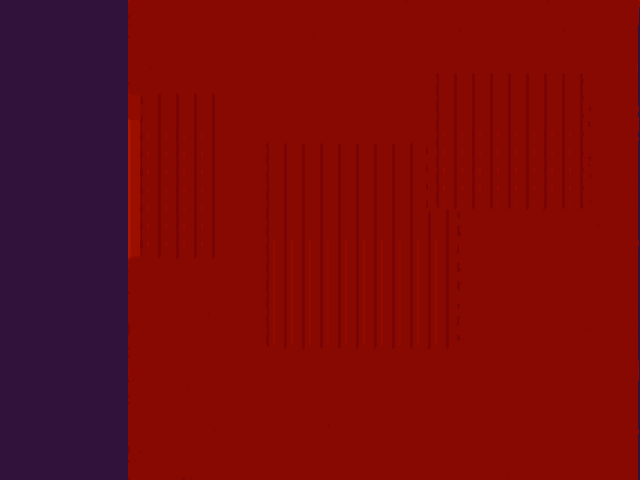
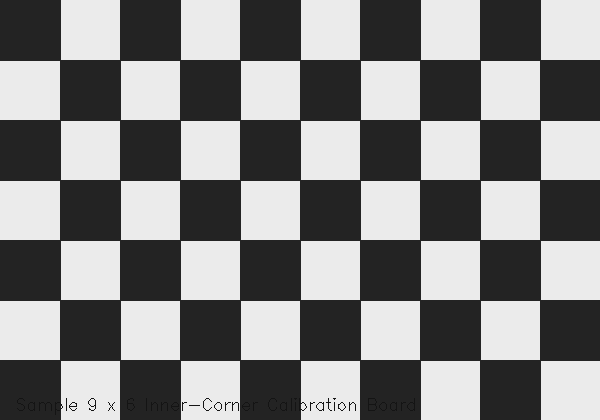

# DepthForge

### Stereo Vision Based Depth Estimation and 3D Reconstruction

DepthForge is a classical Computer Vision pipeline for estimating depth and reconstructing a 3D representation of a scene from a calibrated stereo image pair.

The project implements the complete stereo-vision workflow:

```text
Stereo Image Pair
        │
        ▼
Camera Calibration
        │
        ▼
Stereo Rectification
        │
        ▼
Disparity Estimation
        │
        ▼
Depth Reconstruction
        │
        ▼
3D Reprojection
        │
        ▼
Colored Point Cloud
```

The core stereo-depth relationship is:

\[
Z = \frac{fB}{d}
\]

where:

- `Z` = estimated depth
- `f` = focal length
- `B` = stereo baseline
- `d` = disparity

DepthForge is designed as a terminal-based, reproducible Computer Vision project rather than a black-box depth prediction system.

---

## Demo

The repository includes a deterministic synthetic stereo dataset so that the complete pipeline can be executed without requiring a physical stereo camera.

### Input Stereo Pair

<table>
<tr>
<td align="center" width="50%">

**Left Image**



</td>
<td align="center" width="50%">

**Right Image**



</td>
</tr>
</table>

The two images represent the same scene from slightly different camera viewpoints. The horizontal displacement between corresponding points is used to estimate disparity.

---

## Rectified Stereo Pair

After stereo rectification, corresponding points are aligned along approximately horizontal scanlines.

<table>
<tr>
<td align="center" width="50%">

**Rectified Left**



</td>
<td align="center" width="50%">

**Rectified Right**



</td>
</tr>
</table>

---

## Disparity Map

The disparity map represents the estimated horizontal displacement between corresponding pixels in the left and right images.



Large disparity generally corresponds to objects that are closer to the cameras, while smaller disparity corresponds to farther regions.

---

## Depth Map

The disparity values are converted into depth using the stereo geometry:

\[
Z = \frac{fB}{d}
\]

The resulting depth representation is visualized below.



---

## 3D Reconstruction

Valid disparity values are reprojected into 3D coordinates using the stereo reprojection matrix.

The final point cloud is exported as:

```text
outputs/final_demo/point_cloud.ply
```

The `.ply` file can be opened using applications such as:

- CloudCompare
- MeshLab
- Open3D
- Other PLY-compatible 3D viewers

---

# Features

- Stereo camera calibration
- Chessboard-based calibration
- Lens distortion estimation
- Stereo rectification
- Epipolar geometry handling
- Dense disparity estimation
- Semi-Global Block Matching (SGBM)
- Stereo Block Matching (BM)
- Depth reconstruction
- 3D reprojection
- Colored point-cloud generation
- Numerical disparity and depth export
- Command-line execution
- Configurable stereo parameters
- Automated tests
- Reproducible synthetic demonstration

---

# Computer Vision Concepts

DepthForge demonstrates the following Computer Vision concepts:

- Image formation
- Camera calibration
- Perspective projection
- Stereo geometry
- Binocular stereopsis
- Epipolar geometry
- Stereo rectification
- Image correspondence
- Disparity estimation
- Depth estimation
- 3D reconstruction
- Point-cloud generation

---

# Project Structure

```text
DepthForge/
│
├── .github/
│   └── workflows/
│       └── ci.yml
│
├── assets/
│   ├── calibration_board_sample.png
│   ├── stereo_pair.png
│   ├── stereo_left.png
│   └── stereo_right.png
│
├── config/
│   └── default.yaml
│
├── data/
│   ├── calibration/
│   │   ├── left/
│   │   └── right/
│   │
│   ├── final_demo/
│   │   ├── calibration.npz
│   │   ├── left.png
│   │   └── right.png
│   │
│   ├── stereo/
│   │   ├── left.png
│   │   └── right.png
│   │
│   └── synthetic/
│       ├── calibration.npz
│       ├── left.png
│       └── right.png
│
├── outputs/
│   ├── final_demo/
│   │   ├── depth.npy
│   │   ├── depth_visualization.png
│   │   ├── disparity.png
│   │   ├── disparity_raw.npy
│   │   ├── metrics.json
│   │   ├── point_cloud.ply
│   │   ├── rectified_left.png
│   │   └── rectified_right.png
│   │
│   └── synthetic_demo/
│
├── report/
│   └── project_report.md
│
├── scripts/
│   └── generate_synthetic_demo.py
│
├── src/
│   └── depthforge/
│       ├── __init__.py
│       ├── __main__.py
│       ├── calibration.py
│       ├── cli.py
│       ├── io_utils.py
│       ├── pipeline.py
│       ├── stereo.py
│       └── visualization.py
│
├── tests/
│   ├── test_depth.py
│   └── test_io.py
│
├── .gitignore
├── LICENSE
├── README.md
├── pyproject.toml
├── pytest.ini
├── requirements.txt
└── run_depthforge.py
```

---

# Requirements

- Python `3.10+`
- OpenCV
- NumPy
- PyYAML
- Pytest

The complete pipeline can be executed from the command line without requiring a GUI-based application.

---

# Installation

## Windows

Open PowerShell in the project directory.

### 1. Create a virtual environment

```powershell
python -m venv .venv
```

### 2. Activate the environment

```powershell
.venv\Scripts\Activate.ps1
```

### 3. Upgrade pip

```powershell
python -m pip install --upgrade pip
```

### 4. Install dependencies

```powershell
pip install -r requirements.txt
```

### 5. Optional: Install DepthForge as a package

```powershell
pip install -e .
```

---

## Linux / macOS

```bash
python3 -m venv .venv
source .venv/bin/activate
python -m pip install --upgrade pip
pip install -r requirements.txt
```

Optional:

```bash
pip install -e .
```

---

# Quick Start

The repository already contains a complete synthetic stereo example.

Run the following command from the project root:

```bash
python run_depthforge.py reconstruct \
    --left data/final_demo/left.png \
    --right data/final_demo/right.png \
    --calibration data/final_demo/calibration.npz \
    --output-dir outputs/final_demo \
    --config config/default.yaml
```

### Windows PowerShell

```powershell
python run_depthforge.py reconstruct --left data/final_demo/left.png --right data/final_demo/right.png --calibration data/final_demo/calibration.npz --output-dir outputs/final_demo --config config/default.yaml
```

After execution, the results will be available in:

```text
outputs/final_demo/
```

---

# How the Pipeline Works

## 1. Camera Calibration

Camera calibration estimates the intrinsic parameters and lens distortion of the stereo cameras.

For the stereo setup, the relative transformation between the two cameras is also estimated.

The calibration data contains parameters such as:

```text
K1 / K2
D1 / D2
R
T
R1 / R2
P1 / P2
Q
```

Where:

- `K1`, `K2` are the camera matrices
- `D1`, `D2` are distortion coefficients
- `R` is the relative rotation
- `T` is the relative translation
- `R1`, `R2` are rectification matrices
- `P1`, `P2` are projection matrices
- `Q` is the 3D reprojection matrix

---

# 2. Stereo Rectification

Raw stereo images are not necessarily aligned such that corresponding pixels occur on the same horizontal line.

Stereo rectification transforms the two images into a geometry where matching points lie approximately on the same scanline.

```text
Before Rectification

Left                       Right

   \                        /
    \                      /
     \                    /


After Rectification

Left                       Right

─────────────────          ─────────────────
─────────────────          ─────────────────
─────────────────          ─────────────────
```

This reduces the correspondence problem from a two-dimensional search to an approximately one-dimensional horizontal search.

---

# 3. Disparity Estimation

For a rectified stereo pair:

\[
d = x_L - x_R
\]

where:

- \(x_L\) is the point location in the left image
- \(x_R\) is the corresponding location in the right image
- \(d\) is disparity

DepthForge supports two stereo matching methods:

- `sgbm`
- `bm`

The default method is **Semi-Global Block Matching (SGBM)**.

---

# 4. Depth Estimation

For a rectified stereo camera:

\[
Z = \frac{fB}{d}
\]

where:

- \(Z\) is depth
- \(f\) is focal length
- \(B\) is the camera baseline
- \(d\) is disparity

This means:

```text
Higher disparity → closer object
Lower disparity  → farther object
```

Very small disparity values are sensitive to correspondence errors, which makes accurate stereo matching especially important for distant objects.

---

# 5. 3D Reprojection

After disparity estimation, valid pixels are converted into 3D coordinates using the reprojection matrix `Q`.

Conceptually:

\[
(x,y,d) \rightarrow (X,Y,Z)
\]

Each valid 3D point is also assigned the corresponding color from the left image.

The final result is exported as:

```text
point_cloud.ply
```

---

# Calibration

For a real stereo setup, capture multiple chessboard images using both cameras.

The repository uses the following example calibration pattern:

```text
Inner corners: 9 × 6
Square size:   25 mm
```

A sample calibration-board image is included in:

```text
assets/calibration_board_sample.png
```



---

# Preparing Calibration Images

Place corresponding stereo calibration images in:

```text
data/calibration/
├── left/
│   ├── 01.jpg
│   ├── 02.jpg
│   ├── 03.jpg
│   └── ...
│
└── right/
    ├── 01.jpg
    ├── 02.jpg
    ├── 03.jpg
    └── ...
```

The image pairs must correspond:

```text
left/01.jpg  <->  right/01.jpg
left/02.jpg  <->  right/02.jpg
left/03.jpg  <->  right/03.jpg
```

For a better calibration, use multiple positions and orientations of the checkerboard.

---

# Running Calibration

```bash
python run_depthforge.py calibrate \
    --left-dir data/calibration/left \
    --right-dir data/calibration/right \
    --output outputs/stereo_calibration.npz \
    --pattern-cols 9 \
    --pattern-rows 6 \
    --square-size 25
```

### Windows PowerShell

```powershell
python run_depthforge.py calibrate --left-dir data/calibration/left --right-dir data/calibration/right --output outputs/stereo_calibration.npz --pattern-cols 9 --pattern-rows 6 --square-size 25
```

The calibration process produces a reusable `.npz` file containing the stereo camera parameters.

---

# Running Reconstruction on Real Stereo Images

Place the synchronized stereo images in:

```text
data/stereo/
├── left.jpg
└── right.jpg
```

Then run:

```bash
python run_depthforge.py reconstruct \
    --left data/stereo/left.jpg \
    --right data/stereo/right.jpg \
    --calibration outputs/stereo_calibration.npz \
    --output-dir outputs/reconstruction
```

---

# Reconstruction Options

Display available options:

```bash
python run_depthforge.py reconstruct --help
```

Common options include:

```text
--left
--right
--calibration
--output-dir
--config
--method
--num-disparities
--block-size
--max-depth
--max-points
```

Example using SGBM:

```bash
python run_depthforge.py reconstruct \
    --left data/stereo/left.jpg \
    --right data/stereo/right.jpg \
    --calibration outputs/stereo_calibration.npz \
    --output-dir outputs/reconstruction \
    --method sgbm
```

---

# Output Files

A reconstruction run produces:

```text
outputs/reconstruction/
├── rectified_left.png
├── rectified_right.png
├── disparity.png
├── disparity_raw.npy
├── depth.npy
├── depth_visualization.png
├── point_cloud.ply
└── metrics.json
```

| File | Description |
|---|---|
| `rectified_left.png` | Rectified left image |
| `rectified_right.png` | Rectified right image |
| `disparity.png` | Visual disparity map |
| `disparity_raw.npy` | Raw numerical disparity data |
| `depth.npy` | Numerical depth / reconstructed data |
| `depth_visualization.png` | Visual depth representation |
| `point_cloud.ply` | Reconstructed colored 3D point cloud |
| `metrics.json` | Reconstruction statistics |

---

# Synthetic Demonstration

The repository includes a deterministic synthetic stereo dataset.

This allows the complete pipeline to be tested without requiring a physical stereo camera.

The demonstration files are:

```text
data/final_demo/
├── left.png
├── right.png
└── calibration.npz
```

To regenerate the synthetic demonstration:

```bash
python scripts/generate_synthetic_demo.py
```

Then run:

```bash
python run_depthforge.py reconstruct \
    --left data/synthetic/left.png \
    --right data/synthetic/right.png \
    --calibration data/synthetic/calibration.npz \
    --output-dir outputs/synthetic_demo \
    --config config/default.yaml
```

The synthetic assets are intended for:

- pipeline testing
- reproducibility
- development
- command-line verification

They should not be interpreted as measurements obtained from a physical camera.

---

# Viewing the 3D Point Cloud

After reconstruction, open:

```text
outputs/final_demo/point_cloud.ply
```

using a 3D point-cloud viewer such as:

- CloudCompare
- MeshLab
- Open3D

The exported point cloud contains:

```text
X coordinate
Y coordinate
Z coordinate
R
G
B
```

for valid reconstructed points.

---

# Configuration

Stereo matching parameters can be modified using:

```text
config/default.yaml
```

Typical parameters include:

```yaml
method: sgbm
num_disparities: 128
block_size: 5
max_depth: 20.0
max_points: 300000
```

These parameters influence reconstruction quality, valid-depth regions, and processing time.

---

# Testing

Run the test suite using:

```bash
python -m pytest
```

The repository also contains a GitHub Actions workflow:

```text
.github/workflows/ci.yml
```

which can run the tests automatically.

---

# Evaluation Metrics

For experiments with real stereo data, the following metrics can be reported.

## Valid Disparity Ratio

The percentage of image pixels for which a valid disparity value was obtained.

\[
Valid\ Disparity\ Ratio =
\frac{Valid\ Disparity\ Pixels}
{Total\ Pixels}
\]

## Valid Depth Ratio

The percentage of pixels for which valid depth was successfully reconstructed.

## Calibration Reprojection Error

The difference between detected calibration points and the points predicted by the calibrated camera model.

## Absolute Depth Error

When ground-truth depth is available:

\[
Absolute\ Error =
|Z_{predicted} - Z_{groundtruth}|
\]

## Relative Depth Error

\[
Relative\ Error =
\frac{|Z_{predicted} - Z_{groundtruth}|}
{Z_{groundtruth}}
\]

## Processing Time

The time required to process a stereo pair from rectification through 3D reconstruction.

---

# Limitations

Classical stereo reconstruction has several practical limitations:

- Textureless surfaces may produce unreliable disparity.
- Repetitive patterns can create incorrect correspondences.
- Occluded regions may not have valid stereo correspondences.
- Poor calibration directly affects reconstruction quality.
- Very distant objects can have very small disparity.
- Illumination differences between the two cameras can reduce matching quality.
- Motion between stereo captures can invalidate correspondence.
- Real-world accuracy depends on camera resolution, baseline, optics, calibration quality, and stereo-matching parameters.

---

# Future Improvements

Possible future extensions include:

- Left-right disparity consistency checking
- Improved stereo matching
- Adaptive disparity selection
- Point-cloud outlier removal
- RANSAC-based plane detection
- Surface-normal estimation
- Object-level depth estimation
- Real-time stereo-camera processing
- Visual odometry
- ROS/ROS2 integration
- Depth-aware scene understanding

---

# End-to-End Workflow

```text
                 Stereo Camera
                      │
             ┌────────┴────────┐
             │                 │
             ▼                 ▼
          Left Image       Right Image
             │                 │
             └────────┬────────┘
                      ▼
              Camera Calibration
                      │
                      ▼
              Stereo Rectification
                      │
                      ▼
             Stereo Correspondence
                      │
                      ▼
              Disparity Estimation
                      │
                      ▼
                Depth Estimation
                      │
                      ▼
               3D Reprojection
                      │
                      ▼
              Point Cloud Export
                      │
                      ▼
                 point_cloud.ply
```

---

# Why DepthForge?

DepthForge focuses on the geometry behind stereo depth estimation rather than treating depth prediction as a black-box task.

The project connects:

```text
Camera Calibration
       ↓
Stereo Geometry
       ↓
Correspondence
       ↓
Disparity
       ↓
Depth
       ↓
3D Reconstruction
```

This makes the project useful as both a Computer Vision course implementation and a foundation for further work in 3D vision, robotics, mapping, autonomous systems, and spatial scene understanding.

---

# License

This project is released under the MIT License.

---

# Author

**Aryan Kumar Rai**

**Project:** DepthForge  
**Domain:** Computer Vision  
**Focus:** Stereo Vision, Depth Estimation and 3D Reconstruction